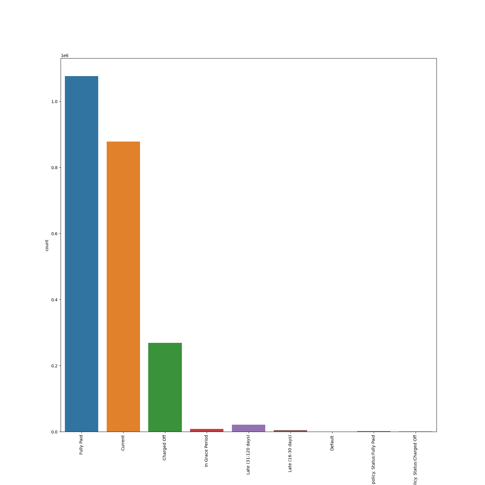
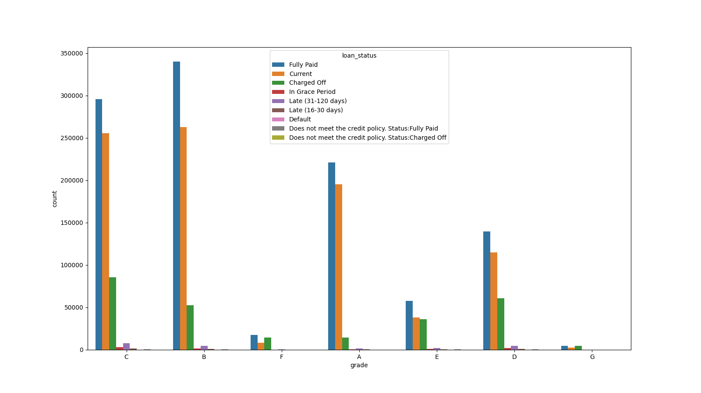
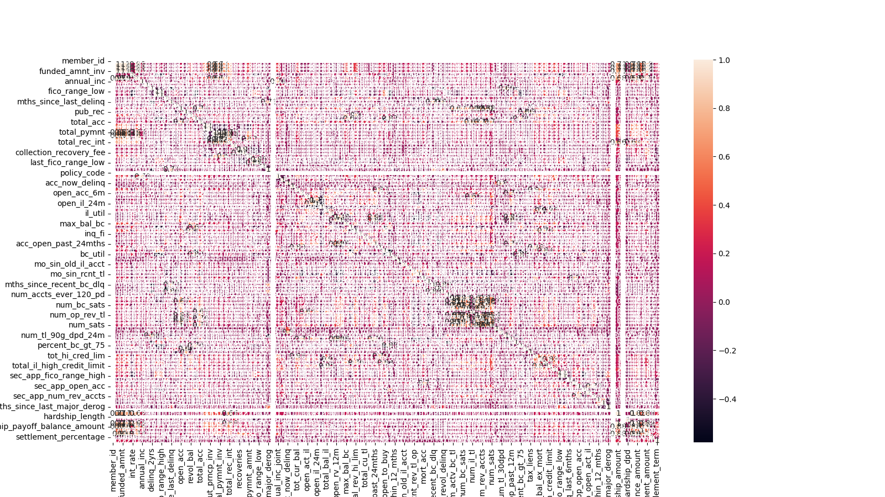
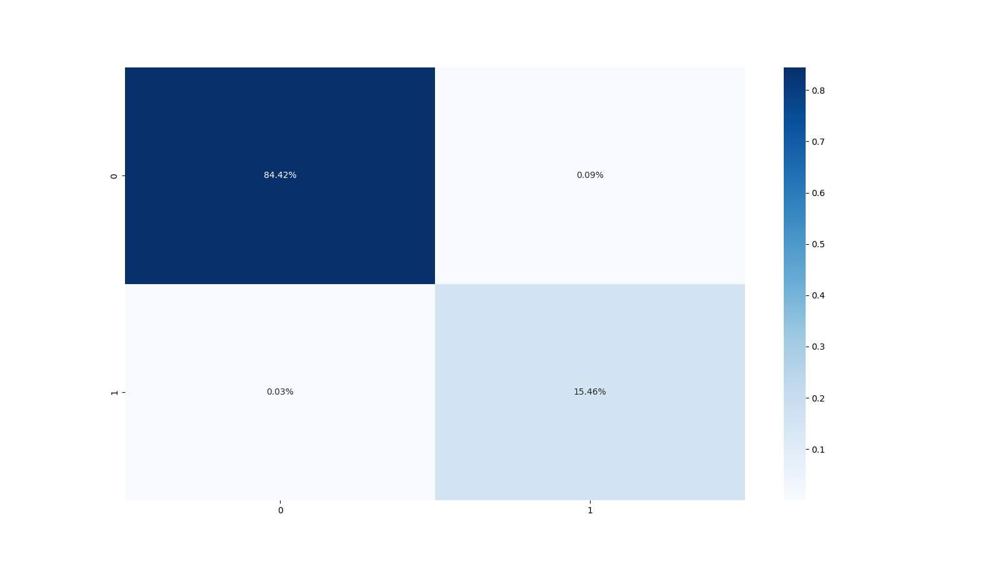
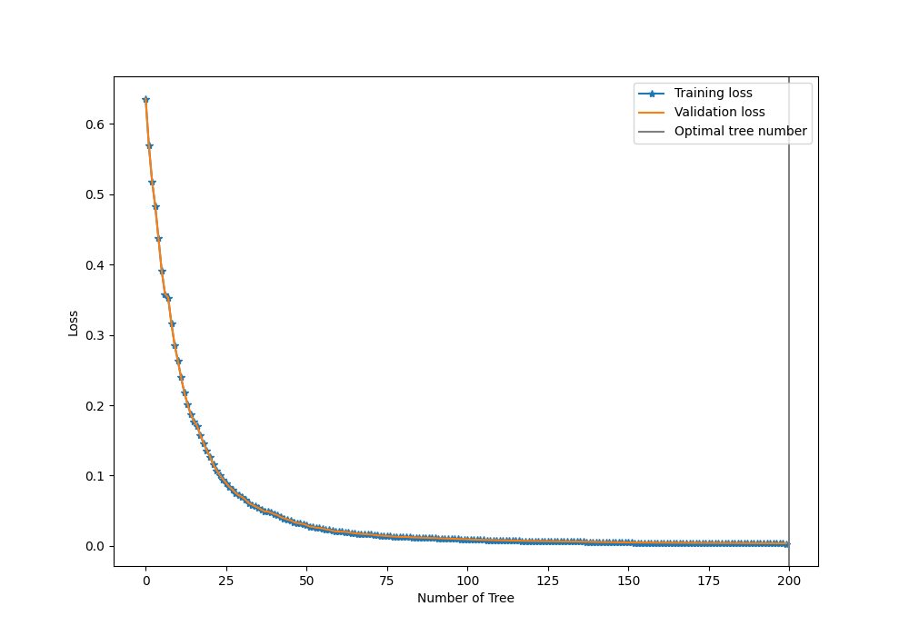
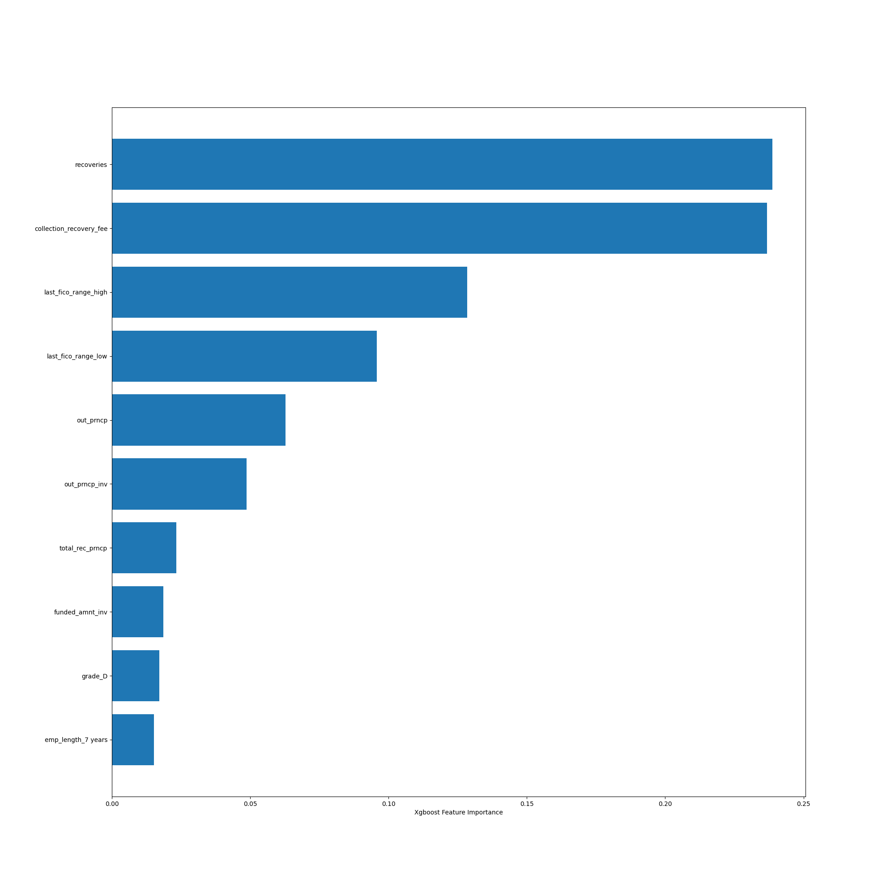

# loan_assesment
## Outline

 
  - [Structure of the project](#structure-of-the-project)
    - [Getting the data](#getting-the-data)
    - [Exploratory Data Analysis (EDA)](#exploratory-data-analysis-eda)
    - [Data Preprocessing](#data-preprocessing)
    - [Training and Validation](#training-and-validation)
    - [Results](#results)
    - [Evaluate revenue based on interest rate and risk grade](#evaluate-revenue-based-on-interest-rate-and-risk-grade)
  - [Steps to run the project](#steps-to-run-the-project)
 

## Structure of the project


The goal of this task is to build a model to predict the probability of a loan issued in 2016 being a charge-off.
To do so, first we need to download the dataset from Kaggle and read the data. This part is addressed in [Getting the data](#getting-the-data).
After that we need to familiarize ourselves with the data and understand the problem better, this part is further discussed in [Exploratory Data Analysis (EDA)](#exploratory-data-analysis-eda).
The next step is to preprocess the data based on the goal of the problem which is discussed in [Data Preprocessing](#data-preprocessing).
Once the data is preprocessed, we have trained a classification model and evaluated this model in [Training and Validation](#training-and-validation). Finally, you can see all the results with their analysis in [Results](#results).
### Getting the data


You can download the lending loan dataset from [Kaggle](https://www.kaggle.com/wordsforthewise/lending-club#accepted_2007_to_2018Q4.csv.gz). Once downloading the dataset, you can unzip and put it inside a folder called data in the root of your project.
To unzip the file in linux you an use the command bellow:
```
gzip -d accepted_2007_to_2018Q4.csv
```
### Exploratory Data Analysis (EDA)


Let us familiarize ourselves with the dataset better. The goal is to predict the probability of a loan being a charge-off. Charge-off  refers to debt that a company believes it will no longer collect as the borrower has become delinquent on payments.
We can find this column from the `loan_status` column in the dataset. This column has 9 unique status. From these 9 status the ones that are of our interest are `Fully Paid`, `Current` and `Charged Off`. Current loan status means that the borrower is making payments on time, so we can assume that this borrower will not have a charge-off.
Now our problem is a classification problem between two classes of charge-off as label 1 and not charge off (current and fully paid) as label 0. 

This dataset has many features that is why just looking at the head of the dataset does not tell much. 
Therefore, we have tried to automate the process of cleaning the dataset and choosing the right features in the processing step. Before, moving on to the preprocessing, we have done some EDAs such as a plot for the loan status counts, bar plot of loan status vs grade of the borrower an dthe heatmap of the pearson correlation of the features.
Let us take a look at these results:



The above heatmap does not tell that much since we have many features. Therefore, let us start preprocessing the data.
### Data Preprocessing


1. Dropping the columns that we know from the beginning that are not useful such as `id` and `url`
2. Dropping the features that their number of missing values are more than  50 % of number of total samples (rows).
3. Now we could simply remove the missing values from the samples (from rows).
4. Filter the data based on the issue date of the loan.
5. Removing the samples based on the loan_status column that are not of our interest such as the samples that have a loan status of `In Grace Period`, `Default`, ...
6. Mapping the lables of loan status (charge-off to 1 and (fully paid and current to 0)).
7. Find all the categorical columns.
8. Drop the columns that have more than 11 categories since if we want to encode them they will add too many columns to the dataset. (The best way to approach this problem in real world and in a big project is to do some feature engineering for those categorical columns that have many categories but since now the time was limited we have avoided doing some feature engineering.)
9. Dropping the columns with one category meaning that this feature is the same for all the samples. Therefore, this does not add any new information.
10. Encode the remaining categorical columns.
11. Grouping the dataset into target (loan_status) and the rest of the features.
12. Splitting the dataset into train and test and standard scaling them.

Every step is defined as a function and all of them have been put together in a function called `preprocesing`.
### Training and Validation

XGBoost (Extreme Gradient Boosting) is one of the state of the art machine learning algorithms to deal with structured data. It belongs to a family of boosting algorithms and uses the gradient boosting (GBM) framework at its core. It is an optimized distributed gradient boosting library. 
In this section, first an XGboost model is trained and its hyperparameters are optimized using cross-validation and the model is used to predict the status of a loan being a charge-off. 

One of the things that we have considered is that in this dataset the classes are imbalanced. 
To address the class imbalance problem, XGBoost provides a hyperparameter designed to tune the behavior of the algorithm for imbalanced classification problems; this is the scale_pos_weight hyperparameter.

By default, the scale_pos_weight hyperparameter is set to the value of 1.0 and has the effect of weighing the balance of positive examples, relative to negative examples when boosting decision trees. 
For an imbalanced binary classification dataset, the negative class refers to the majority class (class 0) and the positive class refers to the minority class (class 1).


The XGBoost documentation suggests a fast way to estimate this value using the training dataset as the total number of examples in the majority class divided by the total number of examples in the minority class.

`scale_pos_weight = total_negative_examples / total_positive_examples`

Based on the above formula, we have set the `scale_pos_weight` to 5.37. We have chosen cross entropy or logistic loss as the loss fucntion of the classifier.
After training, the model is saved using pickle.
The model is used for prediction on the test set and the acuuracy and F1-score an dthe confusion matrix are calculated based on the prediction.


### Results
* The below graph shows the confusion matrix 
    
The accuracy of the model is `0.9988` and the F1-Score is `0.9962` which is prettey high and shows how well the model classifies the two classes.
* Optimal number of trees
  
  Based on the above graph one can tell that the model is not overfitted. One part of the hyperparameter tuning for the XGBoost model is to find the optimal number of trees. The below graph shows the number of trees vs the loss.
  Also, you can find the cross-valiation report [here](plots/cross_validation_report.csv)
* XGboost tree
    
* Feature Importance
    
    The above figure shows the first 10 important features in this classification. 
    The importance matrix is actually a table with the first column including the names of all the features actually used in the boosted trees, 
    the other columns of the matrix are the resulting ‘importance’ values calculated with different importance metrics. We have used the gain metric as an attribute to interpret the relative importance of each feature.

    Gain is calculated based on the the improvement in accuracy brought by a feature to the branches it is on. 
    The idea is that before adding a new split on a feature X to the branch there was some wrongly classified elements, after adding the split on this feature,
     there are two new branches, and each of these branch is more accurate (one branch saying if your observation is on this branch then it should be classified as 1, 
     and the other branch saying the exact opposite). 


     You can see that `recoveries` which is the amount recovered via the treasury cross servicing program after a loan has been charged off is one of the most important features for finding the probability of a loan being charge off in 2016.
     Another important feature is collection recovery fee.

### Evaluate revenue based on interest rate and risk grade
With our current model we can predict whether a customer will endup paying all their debts or not. 
Also, we know that customers with debts have less income to spend because they are paying more interest to lenders.
Therefore, we could conclude that for the lendings with a higher inerest rate if the status of a customer loan be predicted as  not charge-off this customers revenue is increasing that they will be able to pay their debt.
We can hav ethe same scenario for the risk grade. The higher the risk of lending to a customer, the more likely their loan status will end up as charged-off. Therefore, if our model predicts that a customers loan will not be a charge off,
this means that the customer's revenue is increasing.
## Steps to run the project
To run this project, please download the dataset and make a folder called `data` and place the csv file of the dataset there.
Also, please make sure that you are in the same root as the `README.md` file.
* This project is using python=3.8
* Please install the `requirements.txt` file using the command below:
  ```
  pip install -r requirements.txt
  ```
* You can run the main file and get all the results by:
  ```
  python -m src.main
  ```  
* If the dataset is loacted in another folder you can run the code using the following command:
    ```
    python -m src.main -p PATH_TO_DATASET
    ```
